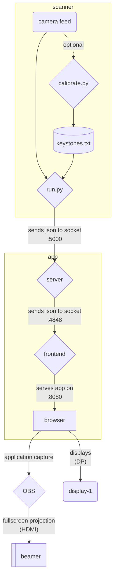

```mermaid
flowchart TB
    subgraph scanner
        direction LR
        cam(camera feed)
        keystones[(keystones.txt)]
        cam -.optional.-> calibrate{calibrate.py}
        cam --> scanner_api{run.py}
        calibrate --> keystones
        keystones --> scanner_api
    end
    subgraph app
        direction LR
        api{server} --sends json to socket\n:4848--> frontend{"frontend"}
        frontend --serves app on \n:8080--> browser
    end
    scanner_api --sends json to socket\n:5000--> api
    browser --application capture--> obs{OBS}
    obs --fullscreen projection\n(HDMI)--> beamer@{ shape: win-pane, label: "beamer" }
    browser --displays\n(DP)--> main_display(display-1)
```
